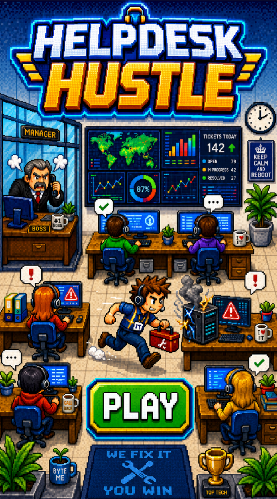
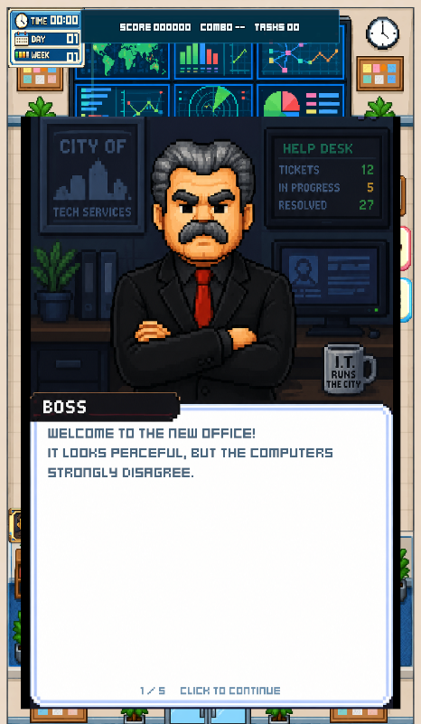
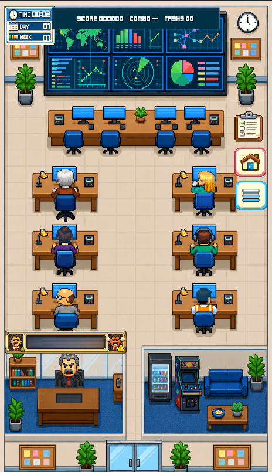
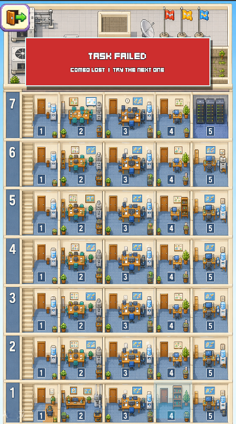
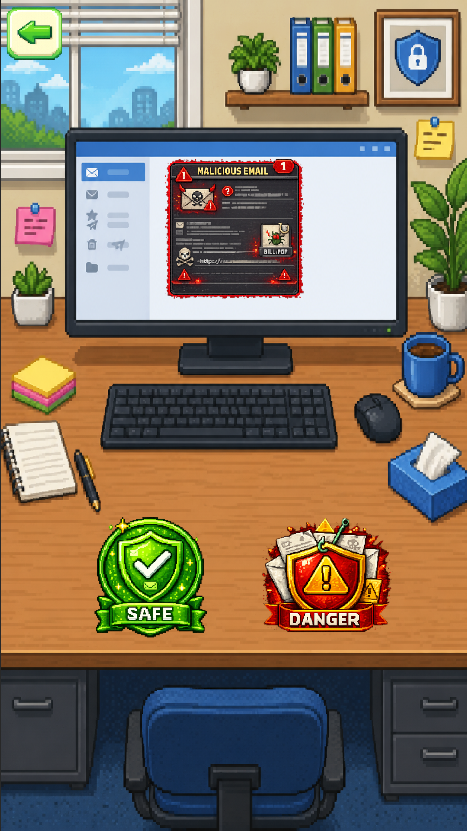
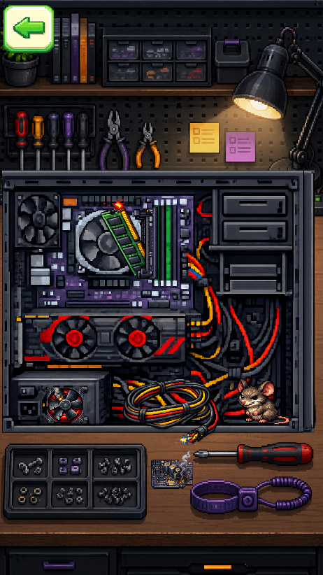

# Helpdesk Hustle

**Helpdesk Hustle** is a portrait-oriented 2D pixel-art office game built with Unity. Step into the role of an IT support technician, respond to urgent tickets across a busy municipal office, solve fast-paced technical mini-games, and keep the boss from losing his patience.

## Gameplay

- Watch the task card and respond before each ticket expires.
- Move between the main office and different floors to reach the reported problem.
- Complete hands-on mini-games involving cables, computers, email security, Wi-Fi, passwords, viruses, servers, and more.
- Build a combo by completing tasks successfully and earn bonus score for quick solutions.
- Avoid failed or abandoned tickets: every mistake raises the boss's anger.
- Survive increasingly demanding weeks with shorter timers, difficulty variants, and dynamic office events.

## Core Features

- A complete score, combo, task, best-score, and survival-time progression system.
- A boss anger meter that turns every missed ticket into real pressure.
- Multiple office floors and rooms connected through a visual navigation screen.
- A growing collection of touch-friendly IT support mini-games.
- Random office events that change task time, score rewards, or failure penalties.
- Pixel-art presentation, animated feedback, procedural sound effects, music, pause controls, and mobile haptics.
- Portrait Android support with safe-area handling and an automated release-validation workflow.

## Mini-Games

The current game includes a variety of technical challenges:

- Connect matching cables and repair faulty hardware.
- Identify safe and malicious emails.
- Hunt viruses and close dangerous pop-up ads.
- Restore Wi-Fi and modem connections.
- Enter passwords and complete security checks.
- Upload files before time runs out.
- Repair computers, monitors, and missing case parts.
- Keep overheating servers under control.

## How to Play

| Input | Action |
| --- | --- |
| **Tap / Click** | Select rooms, buttons, answers, and repair targets |
| **Drag** | Connect cables or manipulate interactive mini-game elements |
| **Back icon** | Leave a room or return to the previous office screen |
| **Pause button** | Pause the shift and manage audio settings |

## Screenshots

### Meet the Boss

### Keep the Office Running

### Navigate Every Floor

### Stop Malicious Email

### Repair the Impossible

## Project Status

Helpdesk Hustle is currently in active development. The core office loop, progression systems, mini-games, and Android build pipeline are implemented, while device testing, final balancing, store assets, and release signing are still in progress.

## Technology

- **Engine:** Unity 6 (`6000.3.20f1`)
- **Language:** C#
- **Rendering:** Universal Render Pipeline with Unity 2D tools
- **Target:** Android, portrait orientation

## Opening the Project

1. Clone the repository.
2. Open the project with Unity `6000.3.20f1`.
3. Import any licensed third-party assets listed in [Third-Party Assets](Docs/THIRD_PARTY_ASSETS.md).
4. Open `Assets/Scenes/Giris_Ekran.unity` and enter Play Mode.

> Licensed Unity Asset Store source files are intentionally excluded from this public repository. They must be obtained directly from their original publisher under a valid license.

---

Built with **Unity 6**.
